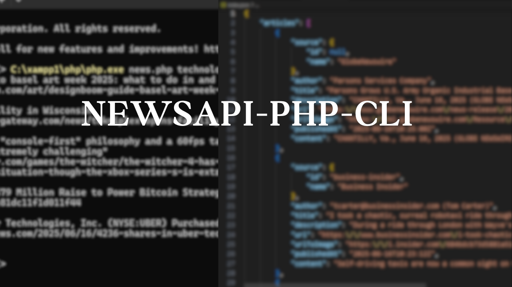

# News Fetcher CLI using PHP + NewsAPI.org


A simple command-line PHP application that fetches the latest news articles from [NewsAPI.org](https://newsapi.org) using a keyword, and stores the results in a `index.json` file with historical data merged.

---

## Features

- Fetches **top headlines** based on a search keyword
- Saves news results to `index.json`
- Merges **new results** with previously saved articles
- Displays news `title` and `URL` in terminal
- CLI (Command-line interface) based tool
- Uses `file_get_contents()` with HTTP headers

---

## Requirements

- PHP installed (`php -v` to check)
- NewsAPI.org API key (free to get)

---

##Setup

1. **Clone the Repository**
   `git clone https://github.com/chunchun-06/PHP-news-fetcher.git`

2. **Move the Project to XAMPP's htdocs Folder**

```bash
cp -r NewsAPI /path-to-xampp/htdocs/
```
